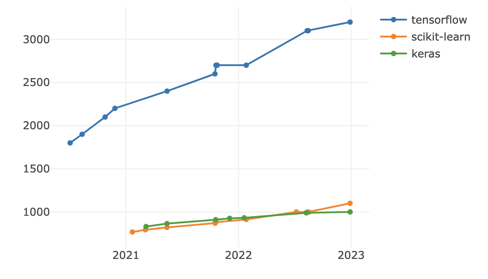

# README

This tool scrapes current and historical data from StackShare to find trends in technology stack adoption.

Instructions:

```
npm install
node fetch tensorflow scikit-learn keras
node plot tensorflow scikit-learn keras
```

Result:



